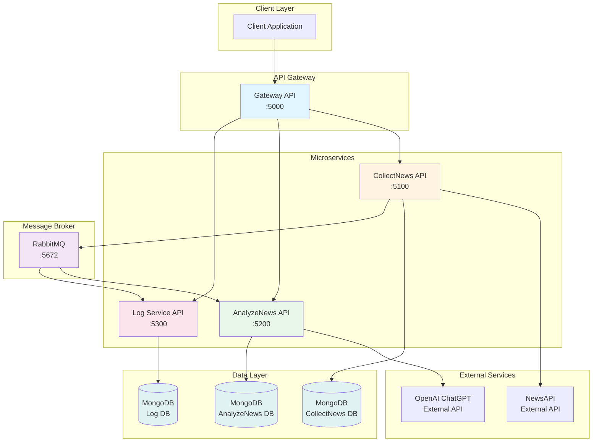
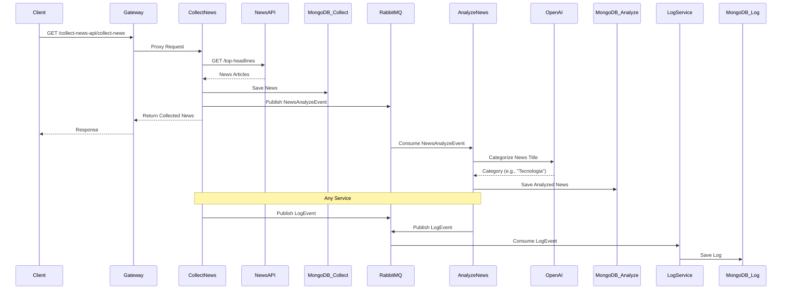
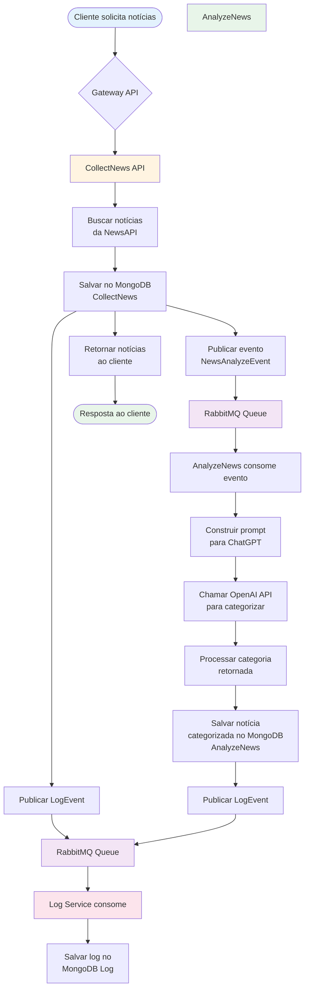
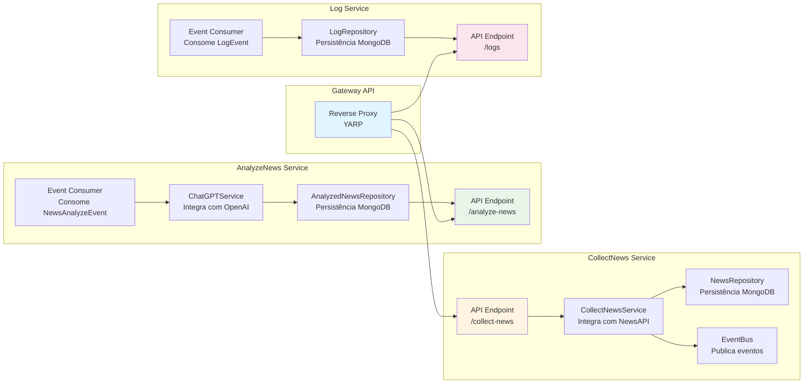
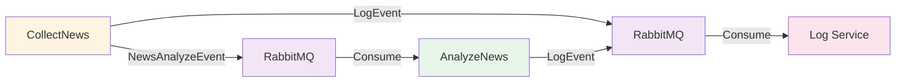

# Agrega News

AgregaNews é uma plataforma inteligente de agregação de notícias que coleta informações de múltiplas fontes e utiliza Inteligência Artificial (IA) para categorizar automaticamente as notícias, proporcionando uma experiência de leitura consolidada e organizada.

## Propósito da Aplicação

O **AgregaNews** foi desenvolvido para resolver o problema de sobrecarga de informações na era digital. A plataforma oferece:

1. **Coleta Automatizada**: Agrega notícias de diversas fontes através da NewsAPI
2. **Categorização Inteligente**: Utiliza OpenAI ChatGPT para classificar automaticamente as notícias em categorias pré-definidas
3. **Arquitetura Escalável**: Baseada em microserviços, permitindo escalabilidade horizontal
4. **Processamento Assíncrono**: Usa mensageria (RabbitMQ) para processar notícias de forma assíncrona
5. **Logging Centralizado**: Sistema de logs centralizado para monitoramento e auditoria

### Funcionalidades Principais

- Coleta de notícias de múltiplas fontes via NewsAPI
- Categorização automática usando IA (ChatGPT)
- API REST para consulta de notícias coletadas e analisadas
- Gateway API para roteamento unificado
- Sistema de logs centralizado
- Health checks para monitoramento
- Documentação Swagger/OpenAPI

## Arquitetura do Sistema

### Diagrama de Arquitetura Geral



### Fluxo de Dados



### Fluxo de Processamento de Notícias



### Componentes e Responsabilidades



## Arquitetura

Para documentação detalhada da arquitetura, consulte: [docs/ARCHITECTURE.md](docs/ARCHITECTURE.md)

### Visão Geral

- **CollectNews API** (`:5100`) - Coleta notícias da NewsAPI
- **AnalyzeNews API** (`:5200`) - Categoriza notícias usando IA (ChatGPT)
- **Log Service API** (`:5300`) - Sistema centralizado de logs
- **Gateway API** (`:5000`) - API Gateway unificado

### Padrões Utilizados

- Clean Architecture
- CQRS com MediatR
- Event-Driven Architecture
- Domain-Driven Design (DDD)

### Stack Tecnológico

- .NET 8, MongoDB, RabbitMQ, Docker, Carter, MediatR, MassTransit, Serilog, Swagger, YARP

## Como Funciona

### Processo Completo

1. **Coleta de Notícias**:

   - Cliente faz requisição ao Gateway para coletar notícias
   - CollectNews API busca notícias da NewsAPI com filtros (país, categoria, página)
   - Notícias são salvas no MongoDB do serviço CollectNews
   - Eventos `NewsAnalyzeEvent` são publicados no RabbitMQ

2. **Análise e Categorização**:

   - AnalyzeNews API consome eventos do RabbitMQ automaticamente
   - Para cada notícia, um prompt é construído e enviado ao ChatGPT
   - ChatGPT categoriza a notícia baseado no título
   - Notícia categorizada é salva no MongoDB do serviço AnalyzeNews

3. **Logging**:

   - Qualquer serviço pode publicar eventos `LogEvent` no RabbitMQ
   - Log Service consome esses eventos automaticamente
   - Logs são armazenados no MongoDB para auditoria e monitoramento

4. **Consulta de Dados**:
   - Cliente pode consultar notícias coletadas via `/collect-news-api/collect-news`
   - Cliente pode consultar notícias analisadas via `/analyze-news-api/analyze-news`
   - Logs podem ser consultados via `/log-api/logs`

## Começando

### Pré-requisitos

- [.NET 8 SDK](https://dotnet.microsoft.com/download/dotnet/8.0)
- [Docker](https://www.docker.com/get-started) and Docker Compose
- [NewsAPI Key](https://newsapi.org/) (for collecting news)
- [OpenAI API Key](https://platform.openai.com/) (for news analysis)

### Setup de Desenvolvimento

1. **Clone o repositório**

   ```bash
   git clone <repository-url>
   cd AgregaNews
   ```

2. **Configure as chaves de API**

   Atualize as chaves de API nos arquivos `appsettings.json`:

   - `CollectNews/source/AgregaNews.CollectNews.Api/appsettings.json`

     ```json
     "NewsApiSettings": {
       "ApiKey": "sua_chave_da_newsapi_aqui"
     }
     ```

   - `AnalyzeNews/source/AgregaNews.AnalyzeNews.Api/appsettings.json`
     ```json
     "OpenAI": {
       "ApiKey": "sua_chave_da_openai_aqui"
     }
     ```

   **Como obter as chaves:**

   > - NewsAPI: https://newsapi.org/ (gratuito com registro)
   > - OpenAI: https://platform.openai.com/ (requer créditos)

3. **Execute com Docker Compose**

   ```bash
   docker-compose up -d
   ```

   Isso iniciará todos os serviços:

   - **CollectNews API**: http://localhost:5100
   - **AnalyzeNews API**: http://localhost:5200
   - **Log Service API**: http://localhost:5300
   - **Gateway API**: http://localhost:5000
   - **RabbitMQ Management**: http://localhost:15672
     - Usuário: `mq_user`
     - Senha: `secret`

### Executando Localmente (sem Docker)

Para desenvolvimento, você pode executar os serviços individualmente:

1. **Inicie as dependências (MongoDB e RabbitMQ)**

   ```bash
   docker-compose up -d agreganews.collectnews.database agreganews.analyzenews.database agreganews.log.database agreganews.rabbitmq
   ```

2. **Execute cada serviço em um terminal separado**

   ```bash
   # Terminal 1 - CollectNews
   cd CollectNews/source/AgregaNews.CollectNews.Api
   dotnet run

   # Terminal 2 - AnalyzeNews
   cd AnalyzeNews/source/AgregaNews.AnalyzeNews.Api
   dotnet run

   # Terminal 3 - Log Service
   cd LogService/source/AgregaNews.Log.LogApi
   dotnet run

   # Terminal 4 - Gateway
   cd Gateway/source/AgregaNews.GatewayApi
   dotnet run
   ```

## Eventos e Mensageria

O sistema utiliza RabbitMQ para comunicação assíncrona entre serviços:

### Eventos Publicados

- **NewsAnalyzeEvent**: Publicado pelo CollectNews quando uma notícia é coletada

  - Contém: Id, Author, Title, Description, Url, UrlToImage, PublishedAt, Content
  - Consumido por: AnalyzeNews API

- **LogEvent**: Publicado por qualquer serviço para logging centralizado
  - Contém: Message, Service, Severity, Environment, StackTrace, ExceptionType, OccurredIn
  - Consumido por: Log Service API

### Fluxo de Eventos



## Documentação da API

Quando os serviços estiverem em execução, você pode acessar a documentação Swagger:

- **CollectNews API**: http://localhost:5100
- **AnalyzeNews API**: http://localhost:5200
- **Log Service API**: http://localhost:5300
- **Gateway API**: http://localhost:5000

### Endpoints Principais

#### CollectNews API

- `GET /collect-news?country={country}&category={category}&pageSize={pageSize}&page={page}` - Coleta notícias

#### AnalyzeNews API

- `GET /analyze-news?size={size}` - Lista notícias analisadas

#### Log Service API

- `GET /logs?page={page}&pageSize={pageSize}` - Lista logs com paginação

#### Gateway API

- `GET /collect-news-api/collect-news` - Proxy para CollectNews
- `GET /analyze-news-api/analyze-news` - Proxy para AnalyzeNews
- `GET /log-api/logs` - Proxy para Log Service

## Health Checks

Todos os serviços expõem endpoints de health check:

- `/health` - Status geral de saúde do serviço
- `/health/ready` - Readiness probe (inclui dependências como MongoDB e RabbitMQ)
- `/health/live` - Liveness probe (verifica se o serviço está vivo)

Esses endpoints são essenciais para orquestradores como Kubernetes ou Docker Swarm monitorarem o estado dos serviços.

## Configuração

A aplicação já vem pré-configurada para desenvolvimento. Você só precisa configurar as chaves de API externas conforme descrito na seção [Começando](#-começando).

### Configurações no docker-compose.yml

O `docker-compose.yml` já está configurado com:

- **MongoDB**: 3 instâncias (CollectNews, AnalyzeNews, Log Service)
- **RabbitMQ**: Message broker para comunicação assíncrona
- **Credenciais padrão**: Configuradas para desenvolvimento

Todas as strings de conexão estão configuradas nos arquivos `appsettings.json` de cada serviço.

## Boas Práticas de Segurança

- **Nunca commite credenciais**: Use variáveis de ambiente ou gerenciamento de secrets
- **Use senhas fortes**: Gere senhas seguras para produção
- **Configure CORS adequadamente**: Restrinja origens permitidas em produção
- **Habilite HTTPS**: Sempre use HTTPS em ambientes de produção
- **Rate limiting**: Considere implementar rate limiting para APIs públicas
- **Autenticação de API**: Implemente autenticação por API key em produção
- **Secrets Management**: Use serviços como Azure Key Vault, AWS Secrets Manager ou HashiCorp Vault

## Testes

Para um guia completo de testes, consulte: [docs/TESTING.md](docs/TESTING.md)

**Teste rápido:**

```bash
# 1. Coletar notícias
curl "http://localhost:5000/collect-news-api/collect-news?country=br&pageSize=5"

# 2. Ver notícias analisadas (aguarde alguns segundos)
curl "http://localhost:5000/analyze-news-api/analyze-news?size=10"

# 3. Ver logs
curl "http://localhost:5000/log-api/logs?page=1&pageSize=10"
```

Ou use a interface Swagger: http://localhost:5000

## Build e Deploy

Para fazer build das imagens Docker:

```bash
docker-compose build
```

Para executar em modo de produção:

```bash
ASPNETCORE_ENVIRONMENT=Production docker-compose up -d
```

**Nota:** Para produção, altere as credenciais padrão no `docker-compose.yml` e configure variáveis de ambiente apropriadas.

## Documentação

- **[TESTING.md](docs/TESTING.md)** - Guia completo de testes
- **[ARCHITECTURE.md](docs/ARCHITECTURE.md)** - Documentação detalhada da arquitetura

## Estrutura do Projeto

```
AgregaNews/
├── AnalyzeNews/          # Serviço de análise de notícias
├── CollectNews/          # Serviço de coleta de notícias
├── LogService/           # Serviço de logging
├── Gateway/              # API Gateway
├── Common/               # Bibliotecas compartilhadas
├── docs/                 # Documentação
├── docker-compose.yml    # Docker Compose
└── README.md             # Este arquivo
```

## Contribuindo

1. Crie uma branch de feature a partir de `develop`
2. Faça suas alterações
3. Escreva/atualize testes
4. Certifique-se de que todos os testes passam
5. Submeta um pull request
